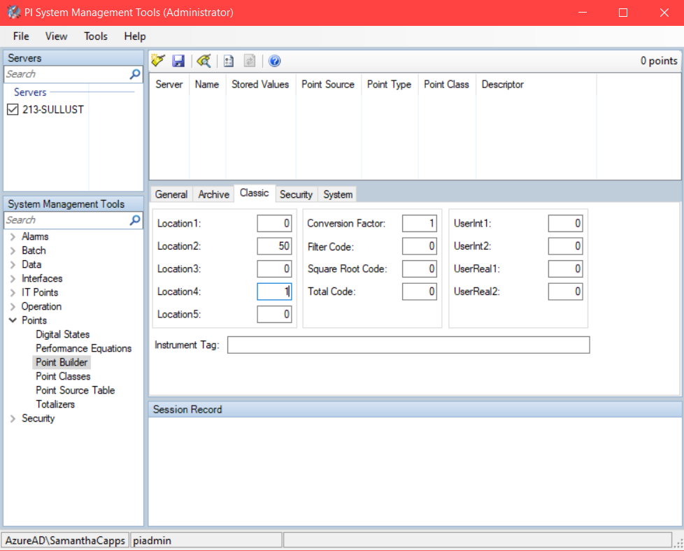
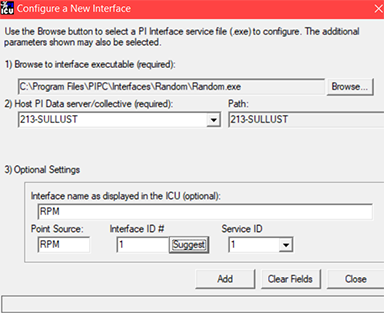
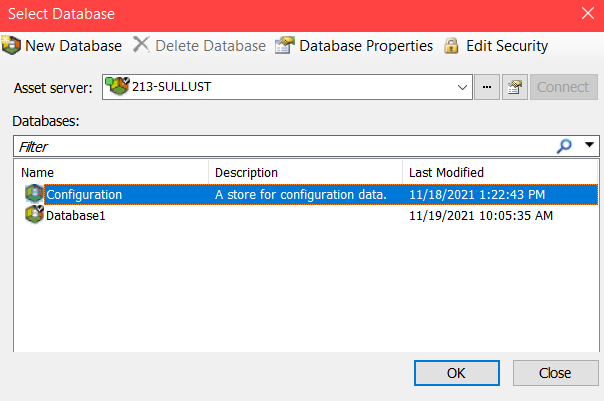
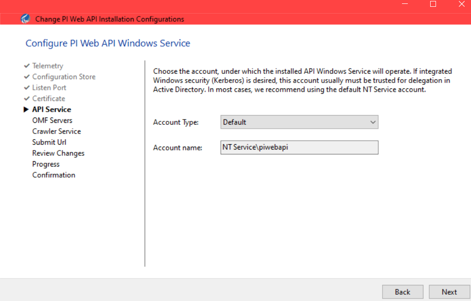
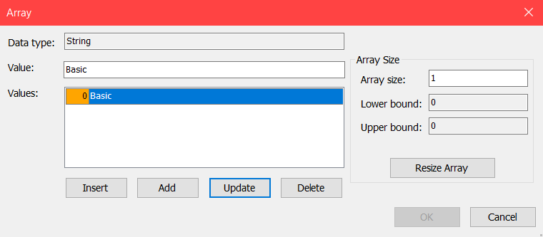

# OSISoft PI Server IIoT and LibreStream OnSight Integration

- [OSISoft PI Server IIoT and LibreStream OnSight Integration](#osisoft-pi-server-iiot-and-librestream-onsight-integration)
- [Introduction](#introduction)
  - [Requirements](#requirements)
- [PI Server Setup](#pi-server-setup)
  - [Installing PI Server Client 2018 SP3 Patch 3](#installing-pi-server-client-2018-sp3-patch-3)
  - [Installing PI AF Client 2018 SP3 Patch 3](#installing-pi-af-client-2018-sp3-patch-3)
  - [Adding an Element](#adding-an-element)
  - [Adding an Attribute](#adding-an-attribute)
  - [Setting Up A Mock Data Feed](#setting-up-a-mock-data-feed)
- [PI Web API](#pi-web-api)
  - [Installing PI Web API](#installing-pi-web-api)
  - [Enabling IDOnly Web IDs (Optional)](#enabling-idonly-web-ids-optional)
  - [Running the PI Web API Admin Utility](#running-the-pi-web-api-admin-utility)
- [Basic Authentication for the PI Web API](#basic-authentication-for-the-pi-web-api)
  - [Enabling Authentication for the PI Web API](#enabling-authentication-for-the-pi-web-api)
- [Integration](#integration)
  - [Hosting the OnSight Integration on an Azure App Service](#hosting-the-onsight-integration-on-an-azure-app-service)
  - [Connect OnSight Connect With Your PI Server IIoT Data](#connect-onsight-connect-with-your-pi-server-iiot-data)
  - [Testing the Integration](#testing-the-integration)
- [Additional Features](#additional-features)
  - [Limits](#limits)

# Introduction

This integration is designed for users with a pre-existing OSISoft PI Server IIoT set-up or who plan to start using the PI Server software who want to be able to see visualizations of their IIoT data within LibreStream's OnSight Connect. Once set up correctly, this integration enables you to scan an ID string from an IIoT device and then receive a visualization of that device's measurements using a live data stream from the PI Server.

## Requirements

In order to setup the PI Server, you will need:

-   An account with Librestream with OnSight Connect enabled

-   An OSISoft account with access to PI Server functionality

-   The capability to host an Azure web application \(App\) service through the cloud or on-premises.

    **Note:** You can use other means for hosting an ASP.NET Core web application but this guide focuses on Azure.

# PI Server Setup

If you already have a PI Server set up with IIoT data, skip to [PI Web API](#pi-web-api). Otherwise, follow these instructions to set up your PI Server with mock data.

The following high-level steps must be completed:

1.  Installing PI Server Client 2018 Service Pack 3 — Patch 3
1.  Installing PI AF Client 2018 Service Pack 3 — Patch 3
2.  Add an element
3.  Setup a mock data feed

## Installing PI Server Client 2018 SP3 Patch 3

1. Go to the [OSISoft Customer Portal](https://customers.osisoft.com) and click the Products tab.

2. Click the Download icon next to PI Developers Club.

3. Look for PI Server 2018 SP3 Patch 3 Installation Kit under Installation Kits and download it.

4. Open the file once it downloads. The two installations you need for this setup are the PI Data Archive and AF Server. No special settings are needed during installation for this integration. Please refer to OSISoft documentation for more details on the installation process and settings.

    

## Installing PI AF Client 2018 SP3 Patch 3

1. Go to the [OSISoft Customer Portal](https://customers.osisoft.com) and click the Products tab.

2. Click the Download icon next to PI Developers Club.

3. Look for the PI Asset Framework (AF) Client 2018 SP3 Patch 3 Installation Kit and download it.

4. Open the file once it downloads. The installation does not require any special settings or configurations.

## Adding an Element

With your database that you want your IIoT data to live in open in the PI System Explorer.

1.  Right-click on **Elements** within the left-side pane to create a new element.

    

2.  The **Choose Element Template** window appears. Accept the default values unless you have a reason to change them and click **OK**.

    

3.  Within the Element tab of your new element, assign a **Name** and **Description**. This can be anything that meets your organization's needs.

    ")

4.  Click **Check In** from the main menu to save your changes to the database. A pop-up menu appears.

    

5.  Click **Check In** again to finalize and save your changes.

    This completes the procedure.

## Adding an Attribute

Attributes are metadata that are associated with an Element. In this example, your Element is a turbine and the attribute we want to locate is the turbine's Revolutions Per Minute \(RPM\).

1.  Click on the **New Attribute** link.

    

    **Tip:** If you already have an attribute within your list, you can right-click and select **New Attribute** to add more.

2.  Verify that your attribute settings appear within the right-side pane. They should resemble what is shown below.

    

    **Note:** Several settings will only appear when you click the **Settings...** button. Do not worry about the default values. You will be setting up a program that will provide mock data to these attributes later on.

3.  The **Tag name** can be anything you want but please make a note of it for later.

    

4.  Click **OK** to finalize your changes.

    This completes the procedure.

## Setting Up A Mock Data Feed

In this task, you will need to create a **PI Point** to provide data to the attribute. **PI Points** are created and managed within the **PI System Management Tools.** For more information about PI Points, please refer to [OSISoft documentation](https://livelibrary.osisoft.com/LiveLibrary/content/en/server-v7/GUID-F987F70E-B3FD-4376-9FFB-16EC6741D0DA#addHistory=true&filename=GUID-160E8B37-F323-4800-A6F5-9B9EDEACFFE4.xml&docid=GUID-922DC43A-0A90-41E6-BB8B-92EC2FC4D6C3&inner_id=&tid=&query=&scope=&resource=&toc=false&eventType=lcContent.loadDocGUID-922DC43A-0A90-41E6-BB8B-92EC2FC4D6C3). For this instance, PI Points function as tags to associate the mock data to your PI Server element attributes.

1.  **Create a PI Point**
2.  Locate and expand **Points** within the **System Management Tools** pane.

    

3.  Enter a name for your PI Point within the **Name** field.

    **Note:** The **Name** is what enables you to connect to your mock data interface.

4.  Select Int32 from the **Point Type** drop-down menu.

    **Tip:** PI Points can also work with integers and doubles values.

5.  Enter a name within the **Point Source** field.

    

6.  The information that follows represents recommended values for a mock data setup.

    

    **Note:** The values on this page do not have any real significance for the purposes of using mock data. A **Zero** defines the lowest values for the data and span expresses how far above **Zero** the value can go with the mock data interface.

7.  Click the **Classic** tab.

    

    **Note:** The Location settings on the **Classic** tab can vary in meaning based on the type of interface you connect to a PI Point. For the purpose of simulating a Random mock data generating interface, **Location1** sets the mock data to generate on a sine wave and **Location2** sets that sine wave to repeat many times within a day. **Location4** defines the **Scan Class** of the interface. This will be explained later. For now, set it to 1.

8.  Click the **Save** icon to create your Point.

    

9.  The Random Interface can be found under the PI Developer Club downloads under the Product tab in the [OSISoft Customer Portal](https://customers.osisoft.com). Look for PI Interface for Random Simulator Data Install Kit. Open the file once it's downloaded. No input is needed for the install.

10. Launch the **PI Interface Configuration Utility** and click the **New** icon.

    

11. Your Random interface will resemble what is shown below.

    

12. Locate the section **1\) Browse to interface executable \(required\)** and click **Browse** and navigate to the Random.exe file that represents the interface.

13. Enter information for your PI Data server.

    1.  Enter the name for the **PI Point** within the **Interface name as displayed in the ICU \(optional\) field**.

    2.  Enter the **Point Source** name within the Point Source field and click **Add.**

14. After adding your interface, observe the **Scan Classes** section of the user interface. The leftmost icon creates a new scan class.

    

15. Enter an interval in hh:mm:ss format as the **Scan Frequency** to determine how often the interface should check its value.

16. Verify that **Scan Class** value is **1**. This value needs to be identical to the **Location4** value we set earlier.

17. Click **Service** to access the **Service Configuration** tab and click the **Create** button.

    

18. The **PI Interface Configuration Utility** pop-up will appear. Read the instructions, and click **Yes**, to add the lines to the files that are open.

    

19. Now you can press the **Play** icon to start the interface. Once it is up and running, return to the **Attribute** in question within the **PI System Explorer** and verify that mock data is populating where required.


    

    **Tip:** You may have to click the refresh button a few times over the course of multiple seconds to see that the value is in fact changing.

    This completes the procedure.

# PI Web API

If you do not have the PI Web API already running or you have the PI Web API running but are not using shortened **IDOnly Web IDs** and want use shortened IDs for ease of use, continue to the procedure [Installing PI Web API](#installing-pi-web-api) below.

If you have the **PI Web API** up and running but do not have Basic Auth enabled, skip to the section [Basic Authentication for the PI Web API](#basic-authentication-for-the-pi-web-api).

If you have **PI Web API** running and are using **Basic Auth** already, skip to the section [Integration](#integration).

## Installing PI Web API

1. Go to the [OSISoft Customer Portal](https://customers.osisoft.com) and click the Products tab.

2. Click the Download icon next to PI Developers Club.

3. Look for PI Web API 2021 SP1 Install Kit under Installation Kits and download it.

4. Open the file once it downloads. No input is needed for the install.

## Enabling IDOnly Web IDs (Optional)

Shortening your WebIDs is an easy-to-change setting that will enable your integration to work with a shorter IoT device strings, which will improve ease of use for your users. In order to use shorter strings, you must:

1.  Launch the PI System Explorer.

    

2.  Click **Database** in the left-side pane.

3.  Select your Configuration database and click **OK**.

    

4.  Expand **Elements** within the left-side pane. Locate and select **System Configuration**.

    

5.  Locate the **WebIDType** setting and change the value to **IDOnly**.

6.  Close \(Exit\) the PI System Explorer.

## Running the PI Web API Admin Utility

1.  Launch the **PI Web API Admin Utility.**

2.  Enable the check box for the **Yes, I would like to participate** in the **PI System Customer Experience Improvement Program**, as necessary. Click **Next**.

    

3.  Next, connect to the **Asset Server** with the IIoT data you are trying to connect to. You must click the **Connect** button to continue. Click **Next**.

    

4.  Leave the settings for the **Listen Port** page as the default values unless you hav a specific need to change it. Click **Next**.

    

5.  The **Certificate** page appears. Click **Select** to choose a certificate to use for your PI Web API endpoint. Click **Next**.

    

    **Note:** If you do not have a certificate, you can use a self-signed certificate. Please refer to the limitations and risks of using [Self-signed Certificates](https://aboutssl.org/what-is-self-sign-certificate) as necessary.

6.  When a certificate thumbprint is displayed, click **Next** to continue.

    

7.  Leave the settings for the **API Service** page as the default values unless you have a specific need to change them. Click **Next**.

    

8.  Verify that the correct servers and database for your data are selected and that there is a green check next to all three indicating that a successful connection has been made. Click the **Confirm** button, when all three green check marks appear. Click **Next**.

    

9. The **OMF Servers** page will update when the servers and database are confirmed. Click **Next** to continue.

    

10. Leave the settings for the **Crawler Service** page as the default values unless you have a specific need to change them. Click **Next**.

    

11. Provide the base Url where your PI Web API can be accessed so that the Search Crawler can access the API. Click **Next**.

    

12. Check your default settings to confirm they are accurate. You must enable the check box for the **Accept all the configurations and click "Next" to apply** to continue. Click **Next**.

    

13. The PI Web API set up process will look like this while it is running.

    

14. When the **Confirmation** page appears, all jobs should be green and say **Done**.

15. Click **Finish**.

    

    This completes the procedure.

# Basic Authentication for the PI Web API

The PI Web API is not set up automatically to use Basic Authentication. Basic Auth is required for this integration.

## Enabling Authentication for the PI Web API

In order to enable authentication, you will need to:

1.  Open the **PI System Explorer.**

2.  Click **Database** in the top left corner.

    

3.  Select your Configuration database and click **OK**.

    

4.  Navigate to the **System Configuration Element** within the **Elements** pane and locate **AuthenticationMethods** under the **Attributes** tab of **System Configuration**.

    

5.  Double-click the **Value** field for **AuthenticationMethods** and add the string "Basic" to the value.

    

    **Tip:** Unless you have a need for other types of authentications, this should be the only value listed.

6.  Click **OK** and now the **PI Web API** is enabled for Basic auth with the users on your server.

    This completes the procedure.

# Integration

## Hosting the OnSight Integration on an Azure App Service

The instructions that follow are for a basic initial setup to support the integration with Microsoft Azure. A production deployment of the integration app may require additional settings and set up to meet your individual requirements.

1.  Navigate to **App Services** in the **Azure Portal** and click **Create**.

    **Note:** Many of the parameters listed here are unique to your set-up. You will need to set your **Publish** setting to **Code** and the **Operating System** setting to **Linux**.

2.  The next step is put the integration code into a repo in **Azure DevOps**. This can easily be done using Git. Refer to [Get started with Git from the command line](https://docs.microsoft.com/en-us/azure/devops/repos/git/share-your-code-in-git-cmdline?view=azure-devops).

3.  Create an Artifact feed. Refer to [Publish and download universal packages with Azure CLI](https://docs.microsoft.com/en-us/azure/devops/artifacts/quickstarts/universal-packages?view=azure-devops#create-a-feed). Ensure that you enable the **Include packages from common public sources** option.

4.  Librestream will provide you with the necessary packages **LibreStream.Api.Common** and **LibreStream.Api.OpenApiUtility** that will enable the PI Server/OnSight integration to work. You must follow the steps below to get these packages into your artifact feed.

    1.  Install the **NuGet Command Line Interface** \(CLI\). Refer to [NuGet CLI.](https://docs.microsoft.com/en-us/nuget/reference/nuget-exe-cli-reference).

    2.  Click the **Connect to Feed** button on the **Artifacts** page.

    3.  Click **Visual Studio** and copy the URL string labelled as **Source**. Use the following command with both packages from above to add them to your **DevOps Artifact feed**. For <YOUR\_FEED\_URL\>, use that **Source URL**.

        ```
         nuget.exe push -Source "<YOUR_FEED_URL>" -ApiKey <ANY_STRING> <PACKAGE_PATH>
        ```

    4.  Verify that the packages are visible in your **Artifacts** feed.

    5.  Navigate to the OSISoft/OSISoft.csproj file in the integration code. Change the URL on line 5 to be the Source URL that you copied from the **Connect to Feed** page.

5.  Next, you will need an **Azure DevOps Pipeline** to deploy the app. There's already an azure-pipelines.yml file in the main directory of the repository. You will need to add data that is unique to your deployment.

    1.  On line 28, insert the name of your Artifacts feed.

    2.  On line 60, insert the full name of your Azure subscription. The format for this name is '\{name\}\(\{id\}\)'. The **name** and **ID** can be found within [the subscriptions page for Azure Portal](https://portal.azure.com/#blade/Microsoft_Azure_Billing/SubscriptionsBlade).

    3.  Line 62 requires the name of the web app you created above.

    4.  Make sure the **ResourceGroupName** on line 64 matches the resource group of your web app.

6.  Run the Pipeline — If all goes well, the **Pipeline status** should display a green checkmark in the end. You can now navigate to the endpoint **\{web\_app\_url\}/api/health** to see if the app is operating as expected.

    This completes the procedure.

## Connect OnSight Connect With Your PI Server IIoT Data

Once your app is up and running, Librestream will assist you in connecting your PI Server to OnSight Connect for IIoT visualization. In order to accomplish this task, you must reach out to your Sales Engineer and provide them with the following information:

1.  The **Username** and **Password** for your PI Server that will connect with OnSight Connect.
2.  The base URL for your PI Web API.
3.  The base URL for your Azure web app.
4.  A name for these **AI Settings**, can be anything you want. This will be used to assign these **AI Settings** to your OnSight Connect users.

Your administrator can now assign the named **AI settings** to your users who need it.

## Testing the Integration

  **Note:** In practice, you can take a photo of the IIoT device's ID string and OnSight's Computer Vision will read the string and allow you to connect to the PI Server integration that way. For immediate testing without the need of a photo of that string, follow the below steps to manually input the string.

To test your integration, you will need to:

1.  Open **Onsight Connect** on any device.

2.  Take a photograph within **OnSight Connect**.

    **Tip:** Typically, this should be a photograph of your IIoT device for testing purposes.

3.  Click **Files** **Computer Vision** within the **Left Toolbar**.

4.  Click to select a photograph. A preview of the image appears to the right.

5.  Click the **Computer Vision** icon to apply labels using Artificial Intelligence \(AI\) functions.

6.  Click the **Plus** icon at the top of the screen. The **Add Tag** window appears.

7.  Enter the device's **web ID** within the **Enter Text** field. You can locate this information within the \{base\_url\}/piwebapi/assetservers by:

    1.  Clicking the Databases link and selecting the Elements link for your database.

    2.  Navigate further down to Elements and locate your device. The **WebID** will be displayed here.

    3.  Enter the device's web ID within the **Enter Text** field in Onsight Connect and click **OK**.

8.  Click the **Magnifying glass** icon next to the PI Server WebID tag you added. This enables OnSight Connect to query your PI Server using the WebID and to display the IIoT data. Unless you receive an error message, you can navigate away from your image and you will still see your live data within the collaboration window of OnSight Connect.

9.  If you want to hide the display of IIoT data, click the **Eye** icon next to the tag. If the **Eye** icon is closed, then data will not be displayed.

    This completes the procedure.


Now that your IIoT data is associated with an image, you can activate its display when necessary.

# Additional Features

## Limits

You can set attributes in OSISoft PI Server to have static caution and warning value limits that will display in yellow and red respectively in OnSight Connection.

In order to define Limits, open PI System Explorer and navigate to an Element then to that Element's Attributes. Right-click an attribute and click Limits.

Lo and Hi will display as yellow caution limits and LoLo and HiHi will display as red warning limits. Make sure to click the checkbox next to each value that you want to be passed to OnSight Connect.